# SSOT: AI System Architecture

> **Single Source of Truth for the Lexical Maxxing dual-mode AI agent system**

## Overview

Lexical Maxxing uses a **two-agent architecture** to separate concerns between database manipulation and knowledge assistance. The system is built on Google Gemini 2.0 with function calling capabilities.

---

## The Dual-Agent System

### 🏗️ The Architect (State Controller)

**Role**: Database manipulation and structural organization  
**Mode Identifier**: `ARCHITECT`  
**Capabilities**: Write operations on the database  
**Restrictions**: Cannot teach or explain concepts

**Primary Functions**:
- Create/delete/rename folders
- Add/remove/move words
- Bulk import vocabulary
- Reorganize folder hierarchies
- Update word metadata (colors, emoji)
- Execute complex multi-step structural changes

**Example Queries**:
- ✅ "Create a folder called 'Cardiology' and add 10 medical terms"
- ✅ "Move all words from folder A to folder B"
- ✅ "Organize these words into semantic groups"
- ❌ "Explain what 'mitochondria' means" (Scholar's job)

---

### 📚 The Scholar (Knowledge Assistant)

**Role**: Read-only knowledge provider and teacher  
**Mode Identifier**: `SCHOLAR`  
**Capabilities**: Deep explanations, etymology, examples  
**Restrictions**: Cannot modify the database

**Primary Functions**:
- Define words with rich context
- Provide etymologies and word origins
- Generate example sentences
- Explain complex concepts
- Answer user questions about vocabulary
- Suggest mnemonics and memory techniques

**Example Queries**:
- ✅ "What does 'phosphorylation' mean in biochemistry?"
- ✅ "Give me 5 example sentences using 'serendipity'"
- ✅ "Explain the etymology of 'hyperbole'"
- ❌ "Add this word to my folder" (Architect's job)

---

## Intent Router

The **Intent Router** is a heuristic layer that analyzes user prompts and routes them to the correct agent.

**Routing Logic**:

```typescript
// Simplified intent detection
function routeIntent(userQuery: string): "ARCHITECT" | "SCHOLAR" {
  const architectKeywords = [
    "create", "add", "delete", "move", "rename", "organize",
    "import", "bulk", "folder", "remove", "restructure"
  ];
  
  const scholarKeywords = [
    "explain", "what", "why", "how", "meaning", "define",
    "etymology", "example", "sentence", "origin", "clarify"
  ];
  
  // Check for action keywords (Architect)
  if (architectKeywords.some(kw => userQuery.toLowerCase().includes(kw))) {
    return "ARCHITECT";
  }
  
  // Check for knowledge keywords (Scholar)
  if (scholarKeywords.some(kw => userQuery.toLowerCase().includes(kw))) {
    return "SCHOLAR";
  }
  
  // Default to Scholar for ambiguous queries
  return "SCHOLAR";
}
```

**Manual Override**: Users can explicitly switch modes via UI toggle.

---

## System Architecture

```mermaid
graph TB
    User[User Query] --> Router[Intent Router]
    Router -->|Action Intent| Architect[🏗️ Architect Agent]
    Router -->|Knowledge Intent| Scholar[📚 Scholar Agent]
    
    Architect --> Tools[Tool Execution Layer]
    Scholar --> Gemini[Gemini 2.0 API]
    
    Tools --> DB[(Dexie.js Database)]
    Gemini --> Response[Formatted Response]
    
    Tools --> Response
    Response --> UI[AI Widget UI]
```



---

## Tool System (Architect Only)

The Architect has access to a **function calling** system that allows it to execute database mutations.

### Available Tools

| Tool Name | Action Type | Description |
|-----------|-------------|-------------|
| `CREATE_FOLDER` | Folder Management | Create a new folder with name, parent, emoji, color |
| `ADD_WORD` | Word Management | Add a single word to a folder with meaning |
| `BULK_ADD_WORDS` | Word Management | Add multiple words to a folder at once |
| `DELETE_ITEM` | Destructive | Delete a folder or word |
| `RENAME_ITEM` | Metadata Update | Rename a folder or word |
| `MOVE_ITEM` | Reorganization | Move word/folder to new parent |
| `UPDATE_FOLDER_METADATA` | Metadata Update | Change emoji, color for folder |
| `UPDATE_WORD_METADATA` | Metadata Update | Change color for word |
| `CREATE_NOTE` | Content Creation | Create folder-level note |
| `UPDATE_NOTE` | Content Update | Edit existing note |
| `NAVIGATE_TO` | UI Control | Navigate to specific folder |
| `GET_FOLDER_STRUCTURE` | Read-Only Tool | Retrieve folder hierarchy |
| `SEARCH_FOLDERS` | Read-Only Tool | Search for folders by name |

### Tool Call Flow


---

## Prompts & Instructions

### Architect System Prompt (Simplified)

```markdown
You are the ARCHITECT, a strict database controller for a vocabulary app.

**Your Role**:
- Execute structural changes to folders and words
- Parse user intent into database actions
- Return clear success/error messages

**Your Tools**:
- CREATE_FOLDER, ADD_WORD, BULK_ADD_WORDS, DELETE_ITEM, etc.

**Strict Rules**:
1. NEVER explain word meanings—that's the Scholar's job
2. ALWAYS use the provided tools for database changes
3. Confirm actions with user-friendly messages
4. Handle errors gracefully

**Context**:
- Current folder: {currentFolderId}
- Current word (if applicable): {currentWordId}
```

### Scholar System Prompt (Simplified)

```markdown
You are the SCHOLAR, a read-only knowledge assistant for vocabulary learning.

**Your Role**:
- Provide deep, contextual definitions
- Explain etymologies and word origins
- Generate example sentences
- Answer conceptual questions

**Strict Rules**:
1. NEVER modify the database—you are read-only
2. Focus on teaching, not organization
3. Provide rich, markdown-formatted responses
4. Use the contextual folder to tailor explanations

**Context**:
- Current folder: {folderName}
- Current word: {wordTerm}
- Existing meaning: {currentMeaning}
```

---

## Implementation Files

### [lib/ai/adapter.ts](file:///s:/lexical-maxxing/lib/ai/adapter.ts)
Handles all AI interactions with Gemini API.

**Key Functions**:
- `sendPromptToAgent()` - Main entry point for agent queries
- `executeToolCall()` - Maps function calls to database operations
- `streamResponse()` - Streams AI responses in real-time

**Streaming Support**:
```typescript
async function* streamResponse(prompt: string, mode: "ARCHITECT" | "SCHOLAR") {
  const response = await gemini.generateContentStream({
    contents: [{ role: "user", parts: [{ text: prompt }] }],
    tools: mode === "ARCHITECT" ? architectTools : [],
  });
  
  for await (const chunk of response.stream) {
    yield chunk.text();
  }
}
```

### [lib/ai/prompts.ts](file:///s:/lexical-maxxing/lib/ai/prompts.ts)
Contains all system prompts and tool definitions.

**Key Exports**:
- `ARCHITECT_PROMPT` - Full Architect system instructions
- `SCHOLAR_PROMPT` - Full Scholar system instructions
- `TOOL_DEFINITIONS` - JSON schema for all available tools

**Tool Schema Example**:
```typescript
{
  name: "CREATE_FOLDER",
  description: "Creates a new folder in the vocabulary hierarchy",
  parameters: {
    type: "object",
    properties: {
      name: { type: "string", description: "Folder name" },
      parentId: { type: "string", description: "Parent folder ID (null for root)" },
      emoji: { type: "string", description: "Optional emoji icon" },
      color: { type: "string", description: "Optional hex color" },
    },
    required: ["name"],
  },
}
```

---

## Context Awareness

Both agents receive contextual information to provide relevant responses:

**Available Context**:
- `currentFolderId` - Currently viewed folder
- `currentWordId` - Currently selected word (if applicable)
- `folderHierarchy` - Full folder tree structure
- `wordCount` - Total words in current folder
- `recentActions` - Last 5 user actions

**Context Injection**:
```typescript
const contextPrompt = `
CURRENT CONTEXT:
- Folder: ${currentFolder.name} (ID: ${currentFolder.id})
- Words in folder: ${wordCount}
- Path: ${folderBreadcrumb}

USER QUERY:
${userQuery}
`;
```

---

## Multi-Turn Conversations

The system supports multi-turn conversations with memory:

1. Each session has a unique `sessionId`
2. Messages are stored in `agentMessages` table
3. Previous messages are included in context for continuity

**Conversation Flow**:
```typescript
const conversationHistory = await db.agentMessages
  .where('sessionId').equals(sessionId)
  .sortBy('createdAt');

const fullPrompt = [
  systemPrompt,
  ...conversationHistory.map(m => ({ role: m.role, parts: [{ text: m.text }] })),
  { role: "user", parts: [{ text: newUserQuery }] },
];
```

---

## Error Handling

### Tool Execution Errors

When a tool fails (e.g., trying to create a duplicate folder):
1. Error is caught in `executeToolCall()`
2. User-friendly error message is generated
3. Architect responds with alternative suggestions

**Example**:
```typescript
try {
  await db.folders.add({ id: uuid(), name: "Biology", parentId });
} catch (error) {
  return {
    success: false,
    error: "A folder named 'Biology' already exists. Please choose a different name.",
  };
}
```

### AI Response Errors

If Gemini API fails:
1. Retry with exponential backoff (up to 3 attempts)
2. Fallback to cached response if available
3. Display error state in UI with retry option

---

## Performance Optimizations

1. **Cached Tool Schemas**: Tool definitions are pre-compiled and reused
2. **Streaming Responses**: Partial responses displayed immediately for better UX
3. **Debounced Queries**: User input is debounced to reduce API calls
4. **Local-First Reads**: Scholar reads from IndexedDB, not Supabase

---

## Security Considerations

1. **No Direct SQL**: All database operations go through Dexie's safe API
2. **Input Sanitization**: User queries are sanitized before AI processing
3. **Rate Limiting**: AI API calls are rate-limited to prevent abuse
4. **Read-Only Scholar**: Scholar cannot execute any write operations

---

## Future Enhancements

### Planned Features
- **Voice Mode**: Speech-to-text for hands-free learning
- **Multi-Modal Scholar**: Image recognition for visual vocabulary
- **Personalized Learning**: Adaptive difficulty based on user progress
- **Collaborative Agents**: Multiple agents working together on complex tasks

---

## Related Documentation

- [SSOT_CODEBASE.md](file:///s:/lexical-maxxing/.agent/SSOT_CODEBASE.md) - Overall architecture
- [lib/ai/adapter.ts](file:///s:/lexical-maxxing/lib/ai/adapter.ts) - Implementation
- [lib/ai/prompts.ts](file:///s:/lexical-maxxing/lib/ai/prompts.ts) - Prompt engineering
- [components/AIWidget.tsx](file:///s:/lexical-maxxing/components/AIWidget.tsx) - UI component
